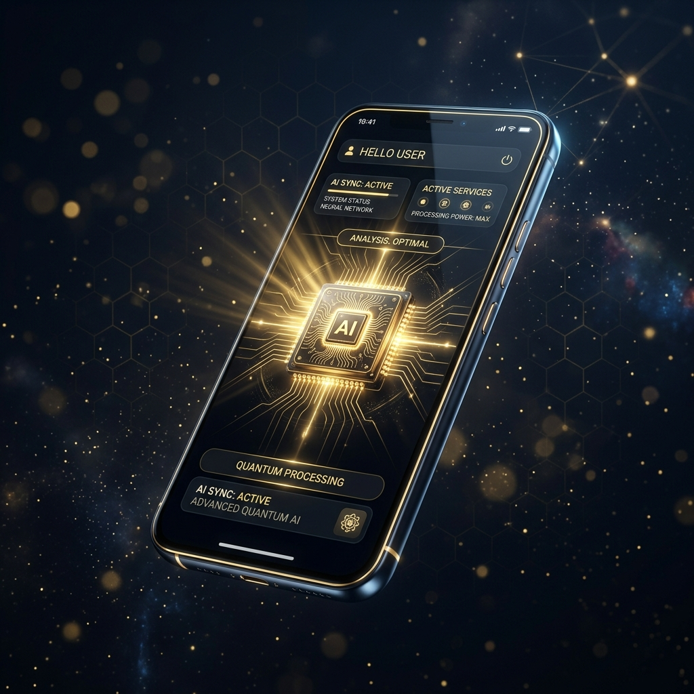
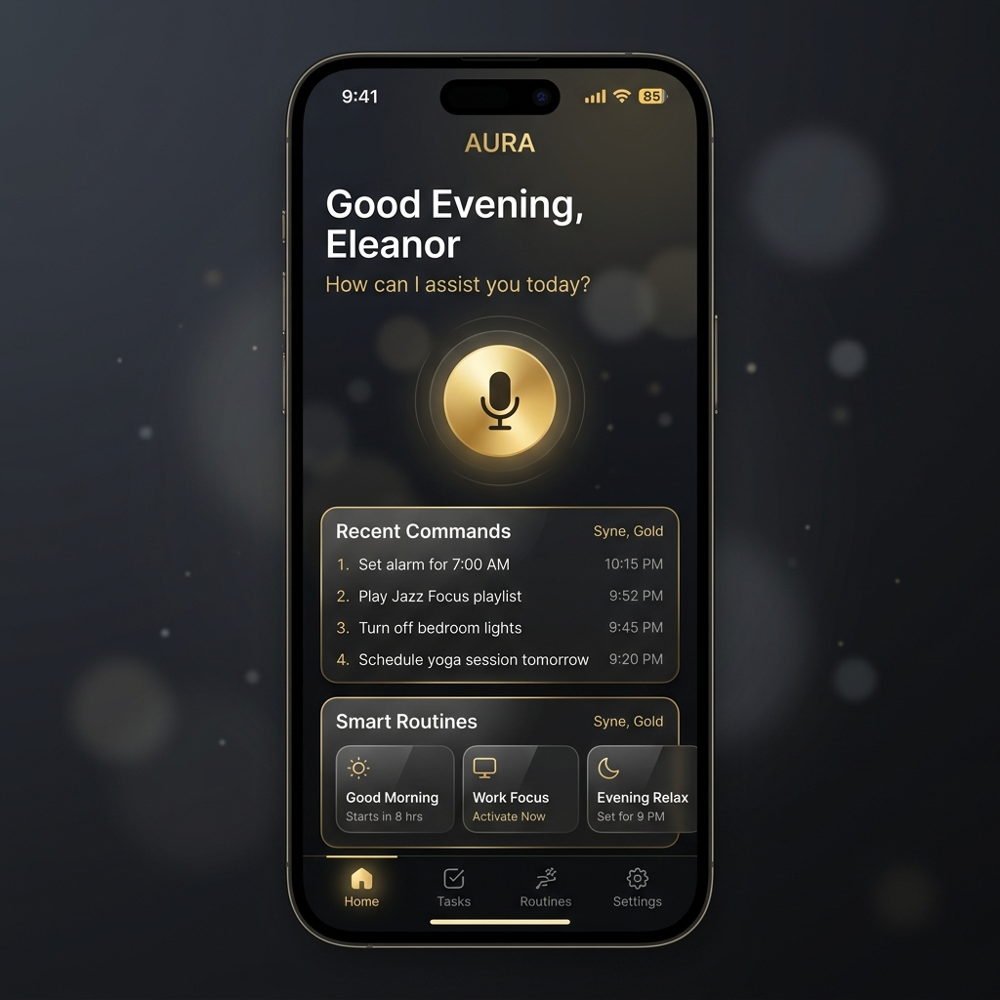
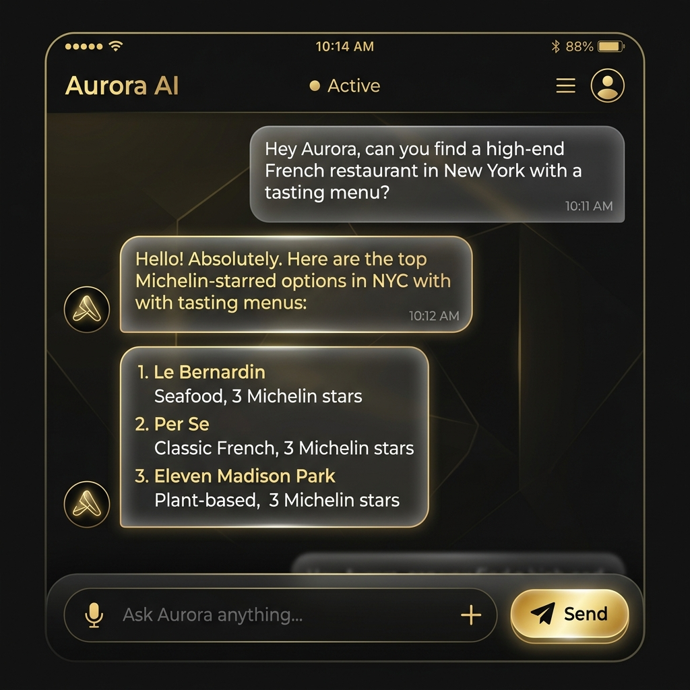

# Future AI Assistant - Android 2025

## Overview
**Future AI Assistant** is the most advanced cognitive companion built for Android. It combines multiple state-of-the-art AI engines with deep system integration to provide a seamless, human-like voice interface and powerful automation routines.

## 🚀 Key Features

### 🧠 Cognitive Memory Engine
Learns your habits, suggests routines, and anticipates your needs. It's not just reactive; it's proactive.

### 🎙️ Neural Voice Interface
Talk naturally with advanced wake-word detection and smart, human-like responses. Powered by the latest neural speech technology.

### ⚡ Multi-AI Engine Support
Switch seamlessly between top-tier AI models to get the best results for any task:
- **Gemini** (Google)
- **GPT-4** (OpenAI)
- **Claude** (Anthropic)
- **NVIDIA AI**

### 📸 Automated Intelligence
Control your entire device by voice. Send messages, adjust system settings, and control third-party apps without lifting a finger.

### 🔒 Privacy Shield
Your data is protected. Secure API storage and wake-only listening ensure that your privacy is never compromised.

---

## 📱 Interface Preview

| Home Dashboard | Voice Interface | AI Chat |
| :---: | :---: | :---: |
|  |  |  |

---

## 🛠️ Technology Stack
- **Frontend**: Android (Kotlin)
- **Backend**: Python-based AI orchestration
- **APIs**: Gemini API, OpenAI, NVIDIA, Anthropic
- **Automation**: Custom Android Accessibility & System Integration

---

## 💰 Pricing Plans

- **Free**: Basic commands, Gemini engine, 20 commands/day.
- **Pro (₹299/mo)**: Unlimited commands, 3 AI engines, habit learning, custom wake words.
- **Ultra (₹699/mo)**: All 5 AI engines, multi-AI switching, priority speed, full automation.

---

## 👨‍💻 About the Developer

Created by **Amit Kumar**, an **ML & DevOps Engineer** focused on building scalable AI systems, automation pipelines, and cloud-native solutions. Amit combines machine learning expertise with DevOps practices to turn ideas into reliable real-world products. Passionate about MLOps, CI/CD, cloud infrastructure, APIs, and intelligent automation. Always creating future-ready technology with performance, security, and innovation in mind.

### About Future AI Systems
**Future AI Systems** is an innovation-driven technology creator focused on building next-generation artificial intelligence products that simplify daily life and transform how people interact with devices. Founded with a vision to merge intelligence, automation, and human convenience, Future AI Systems develops smart digital solutions designed for speed, reliability, privacy, and futuristic user experiences.

---

## 📥 Get Started

Scan the QR code below to download the latest APK:

[Download APK Directly](https://expo.dev/accounts/amitkumar23s-organization/projects/futureai-assitant/builds/50d48116-d3d2-4cab-beef-b45c48020f7f)

---

© 2025 Future AI Systems. Made with ❤️ in India 🇮🇳